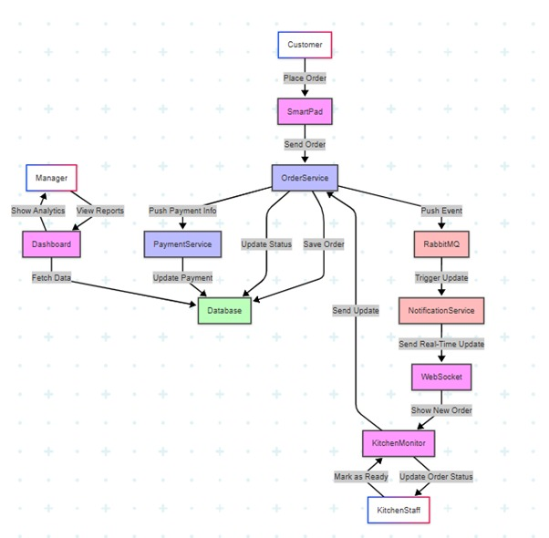
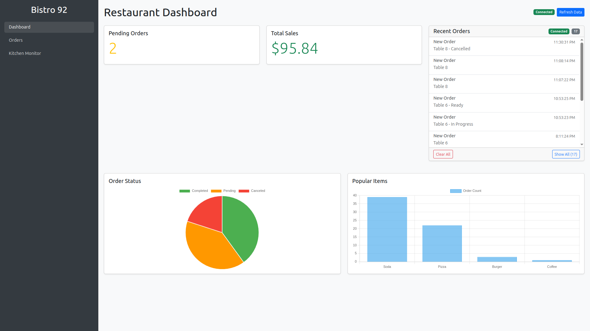
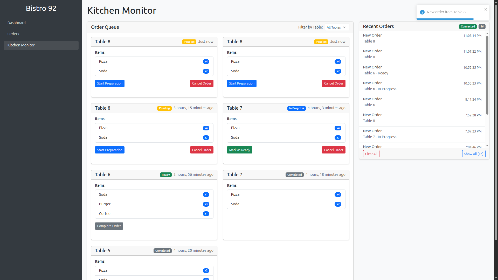

# Bistro-92

A modern restaurant management system built with a microservices architecture.

## Overview

Bistro-92 is a comprehensive restaurant management platform that handles order processing, notifications, analytics, and provides a user-friendly frontend interface. The system is designed with scalability and reliability in mind using a microservices architecture.

## Architecture






The system consists of the following components:

- **Order Service**: Handles customer orders, menu management, and payment processing
- **Notification Service**: Manages communication with customers and staff
- **Dashboard Service**: Provides analytics and reporting capabilities
- **Frontend**: User interface for customers and restaurant staff

### Technology Stack

- **Backend**: Multiple microservices (languages based on service needs)
- **Frontend**: Modern JavaScript framework
- **Databases**: PostgreSQL, Redis
- **Message Broker**: RabbitMQ
- **Workflow Engine**: Temporal
- **Containerization**: Docker & Docker Compose

## Getting Started

### Prerequisites

- Docker and Docker Compose
- Git

### Installation

1. Clone the repository:
   ```bash
   git clone https://github.com/yourusername/bistro-92.git
   cd bistro-92
   ```

2. Start the services:
   ```bash
   docker-compose up -d
   ```

3. Initialize the database (if not done automatically):
   ```bash
   docker-compose exec postgres psql -U postgres -d bistro92 -f /docker-entrypoint-initdb.d/init.sql
   ```

4. Access the services:
   - Frontend: http://localhost:3000
   - Order Service API: http://localhost:8000
   - Notification Service API: http://localhost:3001
   - Dashboard Service: http://localhost:5000
   - RabbitMQ Management: http://localhost:15672 (user: guest, password: guest)
   - Temporal UI: http://localhost:8085
   - Adminer (Database Management): http://localhost:4040

## Services

### Order Service

The Order Service is responsible for processing customer orders, managing the menu, and handling payment processing. It communicates with the PostgreSQL database and uses RabbitMQ for event-driven communication with other services.

- **Port**: 8000
- **Dependencies**: PostgreSQL, RabbitMQ, Temporal

### Notification Service

The Notification Service handles all communication with customers and staff, including order confirmations, updates, and marketing messages. It integrates with external communication providers for SMS, email, and push notifications.

- **Port**: 3001
- **Dependencies**: RabbitMQ, Temporal

### Dashboard Service

The Dashboard Service provides analytics and reporting capabilities, helping restaurant managers make data-driven decisions. It processes data from other services and presents it in an intuitive dashboard.

- **Port**: 5000
- **Dependencies**: PostgreSQL, Redis

### Frontend

The frontend provides a user-friendly interface for customers to place orders and for restaurant staff to manage operations. It communicates with the backend services via APIs.

- **Port**: 3000
- **Dependencies**: Order Service, Notification Service, Dashboard Service

## Database Schema

The database schema is initialized using the SQL script in `order-service/db/schema.sql`. This creates the necessary tables for orders, menu items, customers, and other entities.


